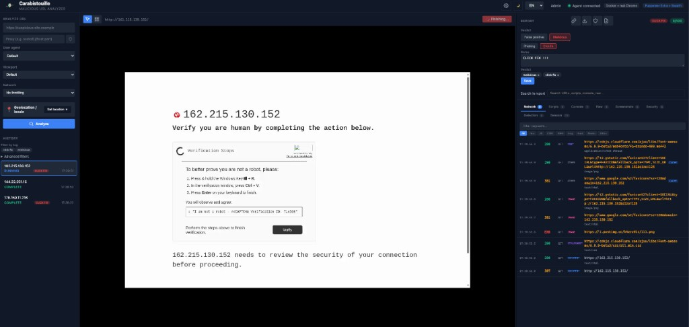

<p align="center"></p>

# Carabistouille

Malicious URL analyzer with remote browser instrumentation. Submit a URL, watch it load in a sandboxed browser (headless Chromium, real Chrome, or Baliverne Chrome/Firefox), interact remotely, and get a security report with risk scoring.

<p align="center"></p>

```
  +-------------------------------------------------------------------------------------------+
  |  ANALYST (browser)                                                                        |
  |  POST /api/analyses { url } -> 201 { id }  |  /ws/viewer/:id  |  WebRTC (Baliverne)       |
  +-------------------------------------------------------------------------------------------+
                                    |
                                    v
  +-------------------------------------------------------------------------------------------+
  |  SERVER (Rust, Axum)                                                                      |
  |  - REST: create Analysis (memory + SQLite), return id                                     |
  |  - Built-in: broadcast Navigate on agent channel  |  Baliverne: create Room, start        |
  |    Docker container (session_id, RTP port), spawn RTP receiver -> WebRTC track            |
  |  - On event: update report, persist, forward to /ws/viewer/:id subscribers                |
  +-----------------------------------+-------------------------------------------------------+
                                      |                                                       |
                  Built-in agent      |      Baliverne (one container per analysis)           |
                                      v                                                       v
  +-----------------------------------+                       +-------------------------------------------------------+
  |  AGENT (Node, one process)         |                       |  CONTAINER (chrome or firefox)                        |
  |  /ws/agent <-> Server              |                       |  /ws/session/:id <-> Server                           |
  |  - Navigate, click, scroll...      |                       |  - X11 :99, Openbox                                   |
  |  - Puppeteer: 1 Chrome per         |                       |  - Puppeteer or Playwright, headless:false, goto(url) |
  |    analysis (or Lightpanda CDP)    |                       |  - GStreamer: ximagesrc -> encode -> RTP -> server    |
  |  - Events: network_request_,       |                       |  - Input: xdotool / xtest / Neko                      |
  |    screenshot, navigation_complete |                       |                                                       |
  +-----------------------------------+                       +-------------------------------------------------------+
                                      |
  Events -> Server -> Viewer.  Video: built-in = screenshots over WS; Baliverne = RTP -> WebRTC.
```

---

## Quick start

| Mode | Command | When |
|------|---------|------|
| **Local** | `cargo run` + `cd agent && npm install && npm start` (two terminals) | Development |
| **Docker agent** | `cargo run -- --agent docker` or `--agent docker:real` | One process, Chrome in container |
| **Baliverne** | Build images: `./scripts/build-baliverne.sh` then `cargo run -- --agent baliverne --listen 0.0.0.0:3000` | One container per analysis, WebRTC video, Chrome or Firefox |

- **Local:** open [http://localhost:3000](http://localhost:3000).
- **Docker agent:** server starts the agent container; open same URL.
- **Baliverne:** containers must reach the server (use `0.0.0.0`); open same URL. Optional STUN/TURN for WebRTC (see [Configuration](#configuration)).

**Prerequisites:** Rust (stable), Node.js ≥ 18, npm. Docker required for `docker` and `baliverne` agents.

---

## Life of an URL

What happens when you submit a URL in the analyst UI.

### Built-in agent (local or Docker)

1. **Browser** → `POST /api/analyses` with `{ "url": "https://…" }` (optional: proxy, user_agent, viewport, geo).
2. **Server** creates an `Analysis` (status `Pending`), stores it in memory + SQLite, and broadcasts `AgentCommand::Navigate` on the agent channel. Returns `201` with analysis `id`.
3. **Agent** (Node, connected on `/ws/agent`) receives the Navigate command. It creates a **new browser session** for this analysis (one Chromium per analysis): `createSession(analysisId, proxy, userAgent, options)` → Puppeteer launches Chrome/Chromium (or connects to Lightpanda if `BROWSER_WS_ENDPOINT`), sets viewport/UA, then `page.goto(url)`.
4. **Agent** sends events back over the same WebSocket: `request`/`response` → `network_request_captured`, `console` → `console_log_captured`, `navigation_complete`, screenshots (WebP), `script_loaded`, `raw_file_captured`, `page_source_captured`, `clipboard_captured`, `detection_event`, etc.
5. **Server** receives each event, updates the in-memory report for that analysis, and forwards events to any **viewers** subscribed to that analysis (e.g. the analyst tab) via `/ws/viewer/:id`. Screenshots are throttled (e.g. 1 s) before forwarding.
6. **Viewer** (analyst UI) is connected to `/ws/viewer/:id`; it gets a `report_snapshot` on connect, then a stream of events. It renders the viewport (screenshot or WebRTC for Baliverne), Network tab, Console, Scripts, etc.
7. When the user clicks **Finish** or the analysis completes, the agent sends `analysis_complete` with the full report; server sets status `Complete`, persists report; viewer shows final risk score and report tabs.

**Summary:** `POST /api/analyses` → server → Navigate on agent channel → agent creates session + `page.goto(url)` → events (network, console, screenshots, …) → server updates report and forwards to viewer → UI updates in real time.

### Baliverne agent (one container per analysis)

1. **Browser** → `POST /api/analyses` with `{ "url": "https://…" }`.
2. **Server** creates an `Analysis` (status `Pending`), then:
   - Creates a **room** (room_id, session_id) and a **Room** in Baliverne state (browser type from config: Chrome or Firefox).
   - Allocates an **RTP port** (for WebRTC video) from the configured range and spawns the RTP receiver task that will feed incoming RTP into the viewer’s WebRTC track.
   - Calls **Docker**: `start_session(session_id, browser, webrtc_rtp)` → creates and starts a container (image `baliverne-chrome` or `baliverne-firefox`) with env `BALIVERNE_WS_URL`, `BALIVERNE_SESSION_ID`, `BALIVERNE_BROWSER`, `BALIVERNE_RTP_HOST`, `BALIVERNE_RTP_PORT`, codec, etc.
   - Stores mappings: `analysis_id` → `(room_id, session_id)`, `room_id` → `analysis_id`.
   - Returns `201` with analysis `id`. **No Navigate is sent yet** — the container is not connected.
3. **Container** starts: X11 dummy display, then Node runtime (`runtime/index.js`). Runtime connects to the server at `BALIVERNE_WS_URL` → **WebSocket `/ws/session/:session_id`**.
4. **Server** (Baliverne WebSocket handler) accepts the connection, finds the room by `session_id`, stores the **runtime command channel** (`runtime_tx`) in the room, and **sends the initial Navigate** (type `navigate`, url from the analysis) over that channel. So the URL is sent as soon as the runtime is ready.
5. **Runtime** receives Navigate. It launches the browser:
   - **Chrome:** Puppeteer, `headless: false`, on `DISPLAY=:99`; one page, viewport set.
   - **Firefox:** Playwright’s Firefox, `headless: false`, on `DISPLAY=:99` (uses Playwright’s bundled Firefox; instrumented for network/console/navigate).
   Then it calls `page.goto(url)`. It also starts the **GStreamer RTP pipeline** (ximagesrc → encode VP8/VP9/H264/AV1 → rtppay → udpsink to `BALIVERNE_RTP_HOST:BALIVERNE_RTP_PORT`). Input (mouse/keyboard) uses xdotool, xtest-injector, or Neko socket.
6. **Runtime** sends the same event types as the built-in agent over the WebSocket (network_request_captured, console_log_captured, navigation_complete, etc.). Server receives them on the same `/ws/session/:id` connection, normalizes to internal `AgentEvent`, updates the analysis report, and forwards to viewers. Video is **not** sent as screenshots; it is sent as **RTP** to the server’s RTP receiver.
7. **Viewer** (analyst UI) for this analysis:
   - Connects to `/ws/viewer/:id` for events (network, console, navigation_complete, etc.).
   - For **video**: uses WebRTC. It requests an SDP offer from the server (e.g. `GET /api/analyses/:id/webrtc-offer` or equivalent); server builds a PeerConnection, creates a TrackLocalStaticRTP, feeds the RTP packets (received from the container’s GStreamer) into that track, and returns the SDP. Viewer sets remote description, sends answer, and displays the video stream.
8. When the user clicks **Finish** or stop, server sends `stop_analysis` to the runtime (via the room’s `runtime_tx`); runtime sends `analysis_complete`, closes the browser, and exits. Server stops the container and cleans up the room and mappings.

**Summary:** `POST /api/analyses` → server creates analysis + room, starts Docker container with session_id → container connects to `/ws/session/:session_id` → server sends Navigate → runtime launches Chrome/Firefox on X11, `page.goto(url)`, starts GStreamer RTP → events over WebSocket, video over RTP → server forwards events to viewer and feeds RTP into viewer’s WebRTC → UI shows report + live video.

---

## Agent modes

| Value | Description |
|-------|-------------|
| `local` | Expect a local agent (`cd agent && npm start`). Agent connects to `ws://host:port/ws/agent`. |
| `docker` | Server starts one container (Puppeteer agent). Headless Chromium in container. |
| `docker:real` | Same, but Chrome headed (Xvfb) for better anti-detection. |
| `docker:lightpanda` | One container: Lightpanda browser + agent (same image). Agent connects to Lightpanda via CDP inside the container. |
| `baliverne` | One Docker container per analysis. Chrome or Firefox (configurable), dummy X11, WebRTC video, STUN/TURN. |
| `baliverne:chrome` | Baliverne with Chrome (default). |
| `baliverne:firefox` | Baliverne with Firefox (Playwright-instrumented). |
| `baliverne:h264` | Baliverne with VP8 → H.264 for WebRTC. |
| `baliverne:chrome:h264` | Chrome + H.264. Order of tokens (browser/codec) is arbitrary. |

Override codec or browser via CLI: `--baliverne-codec vp9`, `--baliverne-browser firefox`, or env `BALIVERNE_VIDEO_CODEC`, `BALIVERNE_BROWSER`.

---

## Browser monitoring and features by agent

How each agent instruments the browser and which report features it provides.

| Feature | Built-in (local / docker*) | Baliverne (chrome / firefox) |
|--------|----------------------------|-------------------------------|
| **Instrumentation** | CDP (Puppeteer), one browser per analysis | Puppeteer (Chrome) or Playwright (Firefox), one container per analysis, X11 + GStreamer |
| **Network** (requests, responses, timing, TLS) | ✅ Full | ✅ Full |
| **Console** | ✅ Full | ✅ Full |
| **Scripts** (inline/external capture) | ✅ | ❌ |
| **Page source / DOM snapshot** | ✅ | ❌ |
| **Clipboard (clickfix)** | ✅ | ❌ |
| **Detection probes** (headless/bot) | ✅ | ❌ |
| **Screenshots** | ✅ Timeline (WebP over WS) | ✅ Timeline (JPEG over WS) |
| **Live viewport** | Screenshots only | ✅ **WebRTC** (RTP from GStreamer) |
| **Security headers** | ✅ | ❌ |
| **Storage** (cookies, localStorage) | ✅ | ❌ |
| **Raw response bodies** | ✅ | ❌ |
| **Risk score** (0–100, full factors) | ✅ | Partial (no clipboard/detection) |
| **Remote input** | CDP (click, scroll, type, key, inspect) | xdotool/xtest/Neko (same actions) |

\* docker = headless Chromium in container; docker:real = headed Chrome (Xvfb); docker:lightpanda = Lightpanda + CDP.

### Built-in agent (local, docker, docker:real, docker:lightpanda)

**How monitoring works:** One Node process (in `agent/`) connects to the server on `/ws/agent`. For each analysis it launches a **dedicated Chromium/Chrome instance** (Puppeteer, or Lightpanda via CDP when `docker:lightpanda`). All instrumentation is done via the **Chrome DevTools Protocol (CDP)** over the same connection:

- **Network:** `page.on('request')` and `page.on('response')` — every request and response is recorded (URL, method, headers, status, timing, TLS details, initiator). Failed requests are captured via `requestfailed`.
- **Console:** `page.on('console')` — all console messages (log, warn, error, etc.) are forwarded.
- **Scripts:** Scripts are captured by injecting hooks with `page.evaluateOnNewDocument()` and by listening to CDP `Debugger.scriptParsed`; inline and external script content is sent as `script_loaded` events.
- **Page source / DOM:** On navigation and at stop, the agent fetches `document.documentElement.outerHTML` and sends `page_source_captured`; at stop it also sends `dom_snapshot_captured`.
- **Clipboard (clickfix):** Before any page script runs, the agent injects interceptors for `navigator.clipboard.writeText`/`write`, `document.execCommand('copy')`, and the `copy` event. After each click or keypress it drains captured writes and sends `clipboard_captured`. The server uses this for **clickfix** detection (clipboard hijacking on user interaction).
- **Detection probes:** The agent injects monitors for properties commonly used to detect headless/automation (e.g. `navigator.webDriver`, WebGL vendor). When the page reads them, a `detection_event` is sent (used in the report and detection panel).
- **Screenshots:** `page.screenshot()` is called periodically (configurable interval) and on navigation/click; each image is sent as a `screenshot` event (WebP). The viewer shows a screenshot-based viewport (or WebRTC for Baliverne only).
- **Security headers:** Response headers of document requests are stored and sent at stop as `security_headers_captured` (CSP, HSTS, etc.).
- **Storage:** At stop, cookies and localStorage are read via CDP and sent as `storage_captured`.
- **Raw response bodies:** For selected text responses (e.g. HTML, JSON), the body is captured and sent as `raw_file_captured`.
- **Redirect chain:** Navigations are tracked and the final redirect chain is included in the report.

**Features available:** Full report: network (with timing and TLS), console, scripts, page source, DOM snapshot, clipboard reads (clickfix), detection attempts, screenshot timeline, security headers, storage, raw files, redirect chain, risk score (0–100) and risk factors. Remote control: click, scroll, move mouse, type, keypress, inspect element. Optional stealth (headless flags, puppeteer-extra) for `docker`/`docker:real`/`docker:lightpanda`.

**Difference between modes:** `local` = you run the agent manually; `docker` = server starts one container with headless Chromium; `docker:real` = same but headed Chrome on Xvfb (better anti-detection); `docker:lightpanda` = agent in container talks to Lightpanda browser via CDP (same instrumentation, different browser binary).

---

### Baliverne agent (baliverne, baliverne:chrome, baliverne:firefox)

**How monitoring works:** One **Docker container per analysis** runs the **runtime** (`runtime/index.js`). The runtime connects to the server on `/ws/session/:session_id`. It launches a **real browser** (Chrome or Firefox) with **headless: false** on a dummy X11 display (`:99`). Instrumentation differs from the built-in agent:

- **Chrome container:** **Puppeteer** launches Chrome/Chromium on X11. The runtime uses `page.on('request')`, `page.on('response')`, and `page.on('console')` — so **network** and **console** are captured the same way as the built-in agent (same event shapes). Input (click, scroll, type, key) is sent to the browser via **xdotool**, **xtest-injector**, or **Neko** (not CDP input), so the real window receives real input events.
- **Firefox container:** **Playwright** launches Playwright’s bundled Firefox on X11. Network and console are instrumented via Playwright’s API; same event types are sent to the server.
- **Screenshots:** The runtime calls `page.screenshot()` at an interval and after navigate/click/scroll/type/key. These are sent as `screenshot` events and used for the **screenshot timeline** in the UI.
- **Video:** The viewport is **not** sent as screenshots for live view. Instead, **GStreamer** captures the X11 display (ximagesrc → encode → RTP) and streams RTP to the server. The server feeds RTP into a WebRTC track; the analyst UI shows **live WebRTC video**.
- **No clipboard hooks:** The runtime does **not** inject clipboard interceptors. There are no `clipboard_captured` events and **no clickfix detection** for Baliverne.
- **No detection monitors:** The runtime does **not** inject headless-detection probes. No `detection_event` is sent.
- **No script / page source / raw file / storage capture:** The runtime does not capture inline scripts, page source, DOM snapshot, raw response bodies, or storage. No `script_loaded`, `page_source_captured`, `dom_snapshot_captured`, `raw_file_captured`, or `storage_captured` events.
- **analysis_complete:** On stop, the runtime sends `analysis_complete` with an **empty report** `{}`. The server still has everything it received over the WebSocket (network, console, screenshots, redirect from navigation); it merges that into the stored report, but fields that were never sent (scripts, clipboard, detection, page source, etc.) remain empty.

**Features available:** Network (request/response, timing, TLS), console logs, screenshot timeline, **live WebRTC video**, redirect chain (from navigation), and remote control (click, scroll, move mouse, type, keypress, inspect element). **Not available:** script capture, page source, DOM snapshot, raw files, storage capture, security headers in report, **clipboard/clickfix**, **detection probes**, and full risk score (risk is only partial because clipboard and detection data are missing).

**Summary:** Baliverne gives you a real browser on X11 with live video and network/console capture, but not the full security-report stack (no clickfix, no detection, no scripts/source/storage). Use it when you need real-browser behavior and live video; use the built-in agent when you need full reporting (clickfix, detection, scripts, risk score).

---

## Baliverne (technical)

- **What it is:** Per-analysis Docker containers running a real browser (Chrome or Firefox) on a dummy X11 display. Video is captured with GStreamer and streamed as RTP to the server; the server feeds RTP into a WebRTC track so the analyst UI shows live video. Input (mouse, keyboard, scroll) is injected via xdotool, xtest-injector, or Neko socket.
- **Chrome container:** Puppeteer launches Google Chrome (or Chromium) with `headless: false` on `DISPLAY=:99`. Network/console/navigate are instrumented via Puppeteer.
- **Firefox container:** Playwright launches **Playwright’s bundled Firefox** (installed in image with `npx playwright install firefox --with-deps`) with `headless: false` on `DISPLAY=:99`. Network/console/navigate are instrumented via Playwright. System Firefox is not used (protocol mismatch).
- **Build images** (from repo root):
  - `./scripts/build-baliverne.sh` — base + Chrome + Firefox (default `linux/amd64`).
  - `./scripts/build-baliverne.sh chrome` or `firefox` or `base` only.
  - Optional: `PLATFORM=linux/arm64` for Firefox on ARM.
- **Run:** `cargo run -- --agent baliverne --listen 0.0.0.0:3000`. Containers need to reach the server (e.g. `host.docker.internal:3000`). Set `BALIVERNE_PUBLIC_HOST` if the viewer uses a different host for WebRTC/ICE.
- **WebRTC:** Server allocates an RTP port per analysis; container sends encoded video (VP8, VP9, H.264, or AV1) to that port. Server runs a small RTP receiver that pushes packets into the viewer’s WebRTC track. STUN (default `0.0.0.0:3478`) and optional TURN are used for ICE; `GET /api/webrtc-ice-servers` returns ICE servers for the UI.
- **End-to-end:** Analysis created → room + container started → runtime connects to `/ws/session/:session_id` → server sends Navigate → browser loads URL, GStreamer streams RTP, runtime sends events → server forwards events and RTP to viewer → analyst sees live video and report.

---

## Configuration

### Flags

| Flag | Description |
|------|-------------|
| `--agent <mode>` | `local`, `docker`, `docker:real`, `docker:lightpanda`, `baliverne`, `baliverne:chrome`, `baliverne:firefox`, `baliverne:h264`, etc. |
| `--baliverne-codec <codec>` | `vp8`, `vp9`, `h264`, `av1` (when using Baliverne). |
| `--baliverne-browser <browser>` | `chrome`, `firefox` (when using Baliverne). |
| `--listen <host:port>` | Bind address. |
| `--database` / `--db` | SQLite path. |
| `--clean-db` | Delete DB before start. |
| `--log-file [path]` | Also write logs to a file (default `carabistouille-YYYY-MM-DD-HH.log` if path omitted). |
| `--mcp` | Enable MCP server on separate port (default 3001). |
| `--wireguard-config <path>` | Mount WireGuard config for Docker agent (browser traffic via VPN). |

### Environment (main)

| Variable | Default | Description |
|----------|---------|-------------|
| `LISTEN` | — | `host:port` bind. Overrides `HOST`/`PORT`. |
| `DATABASE_PATH` | `carabistouille.db` | SQLite file. |
| `LOG_FILE` | — | When set, duplicate logs to this file (default `carabistouille-YYYY-MM-DD-HH.log` if empty). |
| `AGENT` | `local` | Same as `--agent`. |
| `BALIVERNE_BROWSER` | — | `chrome` or `firefox`. |
| `BALIVERNE_VIDEO_CODEC` | `vp8` | WebRTC codec. |
| `BALIVERNE_PUBLIC_HOST` | — | Hostname for containers/ICE (e.g. `host.docker.internal:3000`). |
| `BALIVERNE_STUN_BIND` | `0.0.0.0:3478` | STUN bind. |
| `TLS_CERT` / `TLS_KEY` | — | TLS (PEM). `TLS_SELF_SIGNED=true` for dev self-signed. |
| `SERVER_URL` | `ws://localhost:3000/ws/agent` | Agent WebSocket (built-in agent). |

Full Baliverne options: `src/baliverne/config.rs`.

---

## REST API (concise)

| Method | Endpoint | Description |
|--------|----------|-------------|
| `GET` | `/api/status` | Agent connected, `agent_backend` (builtin/baliverne), `run_mode`, `chrome_mode`, `baliverne_browser`, analyses count. |
| `POST` | `/api/analyses` | Create analysis. Body: `url`, optional `proxy`, `user_agent`, viewport, geo, etc. |
| `GET` | `/api/analyses` | List analyses. |
| `GET` | `/api/analyses/:id` | Get analysis + report. |
| `POST` | `/api/analyses/:id/stop` | Stop running analysis. |
| `DELETE` | `/api/analyses/:id` | Delete analysis. |
| `GET` | `/api/webrtc-ice-servers` | ICE servers for WebRTC (when Baliverne). |

---

## WebSocket

| Endpoint | Role |
|----------|------|
| `/ws/agent` | Built-in agent: server sends commands (navigate, click, scroll, …), agent sends events (screenshot, network_request_captured, navigation_complete, …). |
| `/ws/session/:session_id` | Baliverne runtime: container connects here; server sends commands (navigate, click, …), runtime sends same event types as agent. |
| `/ws/viewer/:id` | Analyst UI: subscribes to analysis `id`; receives `report_snapshot` on connect, then stream of events (and WebRTC for Baliverne video). |

---

## Optional

- **TLS:** `TLS_CERT` + `TLS_KEY` or `TLS_SELF_SIGNED=true`. Agent uses `wss://` and may need `TLS_REJECT_UNAUTHORIZED=false` for self-signed.
- **WireGuard:** `--wireguard-config /path/to/wg0.conf` with `--agent docker`; server mounts config and runs container with `NET_ADMIN`.
- **MCP:** `--mcp` exposes `POST /mcp` on port 3001 for LLM tools (submit URL, list/get analyses).
- **Docker Compose:** `docker compose up` runs server + built-in agent in one container; see `docker-compose.yml`.

---

## Features (overview)

- One browser per analysis (isolation, optional proxy/User-Agent per run).
- Capture: network (full request/response, timing, TLS), scripts, console, raw response bodies, page source, clipboard writes, detection probes.
- Risk score (0–100), redirect chain, mixed content, suspicious JS patterns.
- Screenshot timeline and WebM export; Baliverne: live WebRTC video.
- Viewer: click, scroll, type, keypress, inspect element, Finish (partial report).
- SQLite persistence; admin dashboard; optional VirusTotal check; notes/tags.

Detection evasion (built-in agent): headless flags, stealth patches (navigator, plugins, WebGL, etc.), puppeteer-extra plugin. See code and docs for details.
