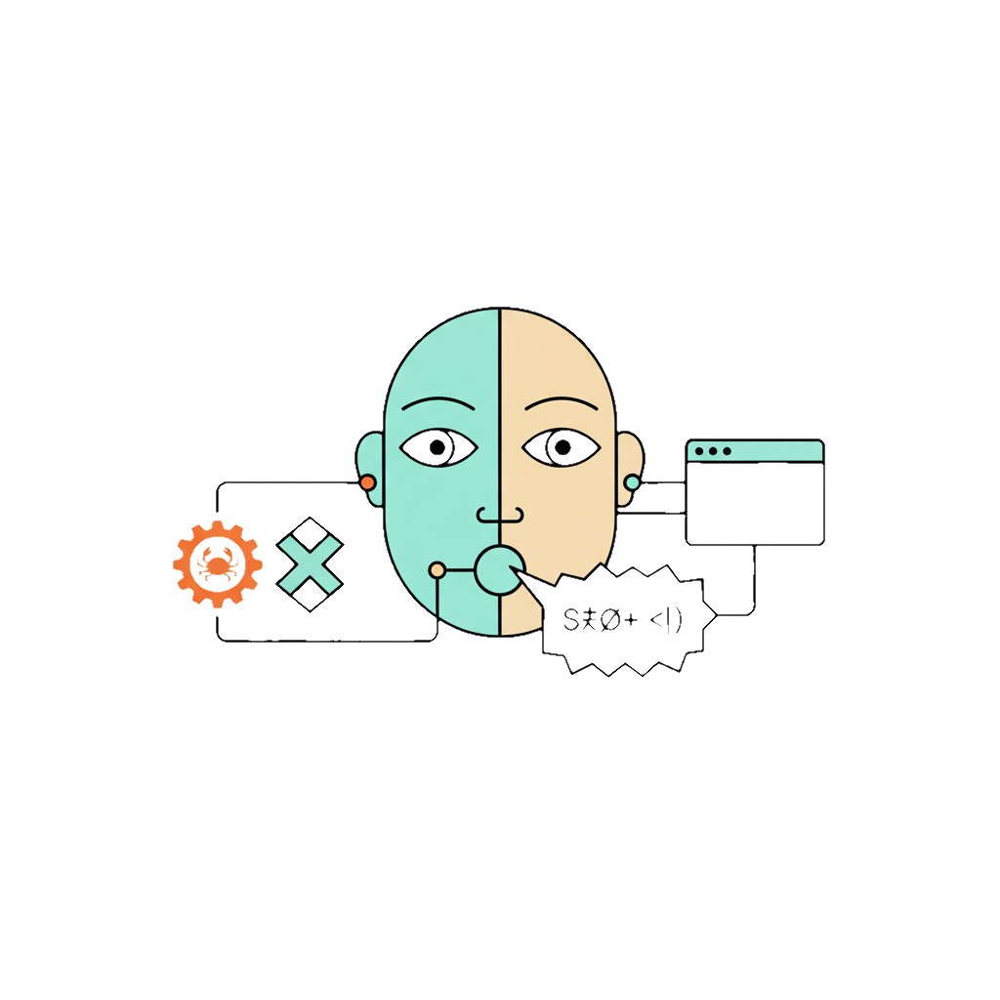

<p align="center"></p>

# Carabistouille

A malicious URL analyzer with remote browser instrumentation. Submit suspicious URLs, watch the page load in a sandboxed headless Chromium, interact with it remotely, and get a detailed security report with risk scoring.

## Architecture Overview

```
 +-----------+     HTTP(S)/WS(S)      +---------------+         WS          +------------------+
 |           | ----GET /api/------->  |               | ----commands-----> |                  |
 |  Web UI   |                        |  Rust Server  |                    | Puppeteer Agent  |
 | (Browser) | <---JSON/events------  |  (Axum+TLS)   | <----events------  |   (Node.js)      |
 +-----------+                        +---------------+                    +------------------+
   |       |                            |           |                        |              |
   |  Analyst                      In-memory        |                   Chromium           |
   |  Dashboard                    DashMap store     |                   (headless or       |
   |  (viewer WS)                   + SQLite         |                    headed / real)     |
   |       |                            |           |                        |              |
   |  Admin                        Broadcast        |                   Engine:             |
   |  Dashboard                    channels        |                   puppeteer |         |
   |                                    |           |                   puppeteer-extra     |
   +--- /index.html                     |      /ws/agent          Screenshots (WebP)       |
   +--- /admin.html                     |      /ws/viewer/:id     Network + Console       |
                                        |      report_snapshot    Detection monitors      |
                                   REST API  on viewer connect    Risk scoring            |
                                   /api/*   fwd throttle 1s       Optional WireGuard VPN  |
                                                                 (route all traffic)     |
```

### Component Responsibilities

```
+------------------------------------------------------------------+
|                          RUST SERVER                              |
|                                                                  |
|  +------------------+  +------------------+  +-----------------+ |
|  |   REST API       |  |  WebSocket Hub   |  |  State Store    | |
|  |                  |  |                  |  |                 | |
|  |  POST /analyses  |  |  /ws/agent       |  |  DashMap        | |
|  |  GET  /analyses  |  |  /ws/viewer/:id  |  |  (analyses)     | |
|  |  GET  /analyses/ |  |                  |  |                 | |
|  |       :id        |  |  Relay commands  |  |  Broadcast      | |
|  |  POST /analyses/ |  |  & events        |  |  channels       | |
|  |       :id/stop   |  |  between viewer  |  |  (agent cmds,   | |
|  |  GET  /analyses/ |  |  and agent       |  |   viewer evts)  | |
|  |    :id/screenshots|  |                  |  |                 | |
|  |  DELETE /analyses |  |  report_snapshot |  |  SQLite persist | |
|  |       /:id       |  |  on viewer connect|  |  Analysis 5m    | |
|  |  GET  /status    |  |  Screenshot fwd   |  |  timeout        | |
|  |                  |  |  throttle 1s      |  |                 | |
|  +------------------+  +------------------+  +-----------------+ |
+------------------------------------------------------------------+

+------------------------------------------------------------------+
|                       PUPPETEER AGENT                             |
|                                                                  |
|  +------------------+  +------------------+  +-----------------+ |
|  |  WS Client       |  |   Analyzer       |  | BrowserManager  | |
|  |                  |  |                  |  |                 | |
|  |  Receives cmds   |  |  Orchestrates    |  |  One Chromium   | |
|  |  Sends events    |  |  analysis flow   |  |  per analysis   | |
|  |  Auto-reconnect  |  |  Captures data   |  |  createSession  | |
|  |  (JSON text)     |  |  Computes risk   |  |  headless/new   | |
|  |                  |  |  Security scan   |  |  or headed      | |
|  |                  |  |  Stop/abort      |  |  (real Chrome)   | |
|  |                  |  |  Raw file capture|  |  puppeteer or   | |
|  |                  |  |  Page source     |  |  puppeteer-extra|
|  |                  |  |  Detection drain |  |  Screenshots    | |
|  |                  |  |  Clipboard poll  |  |  Clipboard hooks| |
|  |                  |  |  WireGuard VPN   |  |  proxy per run   | |
|  +------------------+  +------------------+  +-----------------+ |
+------------------------------------------------------------------+
```

## Analysis Lifecycle

Each analysis spawns a **new** Chromium (headless or headed / real Chrome). No shared browser.

```
 User submits URL            Server creates            Agent receives
 via POST /api/analyses      Analysis (pending)        navigate command
        |                          |                         |
        v                          v                         v
 +-------------+            +-------------+           +-------------+
 |   PENDING   | ---------> |   RUNNING   | --------> |  New Chromium|
 +-------------+            +-------------+  goto()   |  for this ID |
                                   |                   +-------------+
                          navigation_complete               |
                                   |                         v
                          +--------+--------+          +-----------+
                          |  Initial screenshot        | Capture   |
                          |  (right after nav)        | network   |
                          |  Then every 1500ms        | scripts   |
                          |  + after each interaction | console   |
                          v                 |          | raw files |
                   [User clicks      [Analysis         | clipboard  |
                    "Finish"]         completes         | page src  |
                          |          naturally]         | detection |
                          v                 |          | security  |
                   +-------------+          v          +-----------+
                   | Partial     |   +-------------+         |
                   | report      |   |  COMPLETE    |        v
                   | generated   |   |  (w/ report) |  +-----------+
                   +------+------+   +-------------+  | Compute   |
                          |                |          | risk      |
                          +----------------+          | score     |
                                     |                +-----------+
                                     v                      |
                             +-------------+                |
                             |  Report     | <--------------+
                             |  displayed  |
                             +-------------+
```

## Data Flow: Live Interaction

```
 Analyst's Browser                 Rust Server                 Puppeteer Agent
 ==================               ============                ================

 click / scroll / type_text / key_press on viewport
       |
       +--- WS: { type: "click",  ------>  translate to
              x, y } (or scroll,   AgentCommand::Click (or Scroll, TypeText, KeyPress)
              type_text, keypress)         |
       |                                   +--- WS: command  ----->  page.mouse.click(x,y)
       |                                                             (or wheel, type, press)
       |                                                                     |
       |                                                                     v
       |                                                             take screenshot (WebP)
       |                                                                     |
       display screenshot  <------  WS: forward   <------  WS: { type: "screenshot", <-----+
       (Blob URL, WebP)             to viewer(s)            analysis_id, data, w, h }
                                    (throttle 1s)
```

### Supported Viewer Commands

```
 Viewer (Browser)                    Agent Action
 ================                    ============
 { type: "click",    x, y }    -->   page.mouse.click(x, y)
 { type: "scroll",   dx, dy }  -->   page.mouse.wheel(dx, dy)
 { type: "mousemove", x, y }  -->   page.mouse.move(x, y)
 { type: "type_text", text }   -->   page.keyboard.type(text)
 { type: "keypress",  key }    -->   page.keyboard.press(key)
 { type: "inspect",   x, y }  -->   document.elementFromPoint(x, y)
 { type: "stop_analysis" }    -->   abort + partial report
```

## Data Flow: Analysis Events

```
 Puppeteer Agent                  Rust Server                  Web UI
 ===============                  ===========                  ======

 page 'request' event
       |
       +---> (store request: URL, method, resource_type, request_headers, request_body,
       |      initiator, is_navigation; status/response filled on response or failure)

 page 'response' event
       |
       +---> redirect_detected ----------> update redirect   ---> log redirect
       |                                   chain
       +---> network_request_captured ---> update report     ---> add/update Network tab
       |      (status, response_headers, timing, security_details, from_cache,
       |       from_service_worker, response_size, remote_port)
       |
       +---> raw_file_captured ----------> store in report   (not forwarded; large)
                                           (text responses)  add to Raw tab via report_snapshot

 page 'requestfailed' event
       |
       +---> network_request_captured ---> update report     ---> update Network tab
              (failure error text, status_text: Failed)

 page 'console' event
       |
       +---> console_log_captured -------> update report     ---> add to Console tab

 external .js loaded
       |
       +---> script_loaded --------------> update report     ---> add to Scripts tab
              (content stripped when forwarding to viewer)    (metadata only in live stream)

 page.goto() resolves
       |
       +---> navigation_complete --------> status = running  ---> update URL bar, engine badge
       |                                                          show Finish button
       +---> initial screenshot ---------> store + forward   ---> update viewport image
       |     (right after nav)             (throttle 1s)
       +---> page_source_captured -------> store in report   (not forwarded to viewer; large)
       |                                   add to Raw tab (pinned) on report_snapshot

 clipboard write intercepted (monkey-patched APIs)
       |
       +---> clipboard_captured ---------> update report     ---> add to Security tab

 every 1500ms (interval)
       |
       +---> screenshot -----------------> store latest      ---> update viewport image
       |     (WebP, quality 20)            sample timeline       (if throttle allows, 1s)
       |                                   every 3s

 after each interaction (click, scroll, type, keypress)
       |
       +---> screenshot -----------------> store + forward   ---> update viewport image

 detection probes (matchMedia, cookie, location, etc.)
       |
       +---> detection_event -------------> update report     ---> add to Detection tab

 analysis finishes (or user stops)
       |
       +---> analysis_complete ----------> status = complete ---> display full report
              { report: {                  store report           update risk badge
                risk_score,                merge w/ raw_files     hide Finish button
                risk_factors,              & page_source          engine badge
                network_requests,          & detection_attempts
                scripts,
                console_logs,
                clipboard_reads,
                detection_attempts,
                security,
                redirect_chain,
                engine
              }}
```

### Technical Details (Reference)

| Area | Value / behaviour |
|------|-------------------|
| **Screenshots** | **When:** (1) once right after `navigation_complete`, (2) every **1500 ms** on an interval, (3) after each interaction (click, scroll, type_text, key_press). **Format:** WebP, quality 20, `optimizeForSpeed`, `captureBeyondViewport: false`. **Transport:** Agent sends JSON text event `{ type: "screenshot", analysis_id, data (base64), width, height }`. **Server:** Stores latest in `analysis.screenshot`; samples into timeline every **3 s**; forwards to viewers at most every **1000 ms** (throttle). **UI:** Decodes base64 to Blob, displays via `URL.createObjectURL(blob)` (image/webp). |
| **Viewport** | 1280×800 (config: `browser.viewportWidth`, `browser.viewportHeight`). |
| **Navigation** | Timeout **30 s** per attempt; strategies: `networkidle2`, `domcontentloaded`, `load`; CDP `Page.navigate` fallback if all fail. |
| **Analysis timeout** | **5 minutes**; server sends `stop_analysis` if still running. |
| **Event forwarding** | **Not forwarded to viewers** (to avoid lag): `raw_file_captured`, `page_source_captured`, `dom_snapshot_captured`. **Forwarded lightweight:** `script_loaded` without `content`. Full data remains in server state and in `report_snapshot` on viewer connect. |
| **Viewer on connect** | Server sends `report_snapshot` (report + status), then latest screenshot, then `screenshot_timeline_available` if any; viewer subscribes to broadcast for live events. |
| **Browser engine** | `puppeteer` (plain + manual stealth) or `puppeteer-extra` (stealth plugin); config/env `BROWSER_ENGINE`. Shown in UI engine badge. |
| **Headless / real Chrome** | Default `headless: 'new'`. Set `HEADLESS=false` or `REAL_CHROME=1` for headed (real Chrome); in Docker, entrypoint starts Xvfb and sets `DISPLAY=:99`. |
| **Detection tab** | Injected monitors record access to `navigator`, `screen`, `matchMedia`, `document.cookie`, `window.location`, etc.; events sent as `detection_event` and shown in Detection tab. |
| **Network tab** | Requests shown **newest first**; resource type filter (All, Doc, JS, CSS, XHR, Img, Font, Media, Other). |

## Risk Scoring

The agent computes a risk score from 0 to 100 based on these factors:

```
 Factor                              Points
 ======                              ======
 Multiple redirects (> 2)            +20
 High third-party requests (> 20)    +15
 No HTTPS                            +25
 Mixed content                       +10
 Suspicious JS patterns (each):      +15
   - eval() + unescape()
   - document.write(unescape(...))
   - Excessive iframes (> 5)
   - Hidden forms
   - Delayed redirect (setTimeout)
   - Cross-origin form submission
 Excessive inline scripts (> 10)     +10
 Clipboard hijack detected           +30
                                     --------
                              max    100
```

## Per-analysis Browser Isolation

Each analysis runs in its **own** Chromium process (headless or headed / real Chrome). There is no shared browser.

```
 Analysis A  -->  Chromium instance 1  -->  Target URL A
 Analysis B  -->  Chromium instance 2  -->  Target URL B
 Analysis C  -->  Chromium instance 3  -->  Target URL C
```

Benefits:

- **Isolation** — No shared cookies, cache, localStorage, or process state between analyses.
- **Safety** — A malicious page cannot affect other analyses or the agent process.
- **Proxy per run** — Each analysis can use a different proxy (or none); the agent spawns Chromium with the right `--proxy-server` for that run.
- **User-Agent per run** — Each analysis can use a custom User-Agent (preset or custom string); the agent calls `page.setUserAgent()` before navigation to simulate other devices or browsers.
- **Clean teardown** — When an analysis ends, its browser can be closed; other analyses keep running in their own Chromium.

The agent keeps a session map (`analysis_id` → `{ browser, page }`). On `navigate`, it calls `createSession(analysisId, proxy, userAgent)` to launch a new Chromium (with optional proxy and User-Agent); interaction commands (click, scroll, etc.) are routed to that session by `analysis_id`.

## Proxy Support

Route analysis traffic through a proxy to avoid exposing your IP address.

```
 Without proxy:                    With proxy:

 Chromium A --> Target Site        Chromium A --> Proxy --> Target Site
   (your IP exposed)                 (proxy IP exposed, yours hidden)
```

Set the proxy per analysis in the UI sidebar (shield toggle) or in the API:

```bash
curl -X POST http://localhost:3000/api/analyses \
  -H 'Content-Type: application/json' \
  -d '{"url": "https://suspicious.example", "proxy": "socks5://127.0.0.1:9050"}'
```

Supported formats: `http://host:port`, `socks5://host:port`, `socks4://host:port`.

Each analysis gets a **new** Chromium instance; if you pass a proxy, that instance is launched with `--proxy-server=<proxy>`.

## User-Agent Simulation

Simulate different devices or browsers by setting a custom User-Agent before analyzing.

In the UI, use the **User agent** dropdown in the sidebar: choose **Default** (Puppeteer default), a preset (**Chrome (Desktop)**, **Safari (iPhone)**, **Chrome (Android)**, **Firefox (Desktop)**), or **Custom…** and paste any User-Agent string.

Via API:

```bash
curl -X POST http://localhost:3000/api/analyses \
  -H 'Content-Type: application/json' \
  -d '{"url": "https://example.com", "user_agent": "Mozilla/5.0 (iPhone; CPU iPhone OS 17_0 like Mac OS X) AppleWebKit/605.1.15 (KHTML, like Gecko) Version/17.0 Mobile/15E148 Safari/604.1"}'
```

The agent applies the User-Agent with `page.setUserAgent()` before navigating to the URL.

## Headless Chrome Detection Evasion (Reference)

Some sites try to detect headless browsers. This section documents common detection mechanisms and how the agent mitigates them.

### Active Detection Mechanisms (Common in the Wild)

**1. Media query support test**

```javascript
const prefersDark = window.matchMedia && window.matchMedia('(prefers-color-scheme: dark)').matches;
```

- Older headless Chrome (pre-2019) didn’t properly support `prefers-color-scheme` and could return `false` or `undefined`.
- **Mitigation:** The agent uses the Chromium flag `--force-prefers-color-scheme=dark` so the media query matches.

**2. Cookie persistence**

```javascript
const oldTheme = document.cookie.split('; ').find(row => row.startsWith('theme='));
if (!oldTheme || oldTheme.split('=')[1] !== currentTheme) { window.location.href = "/"; }
```

- Headless setups that don’t persist cookies between requests fail this check.
- **Mitigation:** Puppeteer’s default behavior persists cookies; no extra config needed.

**3. Media query change listener**

```javascript
window.matchMedia('(prefers-color-scheme: dark)').addEventListener('change', ...);
```

- Basic headless Chrome may not fire these events.
- **Mitigation:** New headless mode (`headless: 'new'`) and `--force-prefers-color-scheme` give realistic behavior.

### Common Detection Methods (Often Checked)

| Check | What it catches | Agent mitigation |
|-------|-----------------|------------------|
| `navigator.webdriver === true` | Selenium/WebDriver flag | `--disable-blink-features=AutomationControlled` + injected patch setting `navigator.webdriver` to `false` |
| `window.chrome === undefined` | Chrome-specific object missing | Injected `window.chrome` and `chrome.runtime` stub |
| `navigator.plugins.length === 0` | Headless has no plugins | Injected fake plugins (e.g. Chrome PDF Plugin, PDF Viewer, Native Client) |
| `navigator.languages === []` | Empty language array | Injected `['en-US', 'en']` |
| WebGL vendor/renderer | “Google Inc.” / “ANGLE” fingerprint | Injected “Intel Inc.” / “Intel Iris OpenGL Engine” |
| `navigator.hardwareConcurrency` | Often 1–2 in headless | Injected value 8 |
| `navigator.deviceMemory` | Low or undefined | Injected value 8 |
| `navigator.connection` | Undefined in headless | Injected `effectiveType: '4g'`, `rtt: 50`, etc. |
| `navigator.vendor` / `pdfViewerEnabled` | Missing or wrong | Injected `Google Inc.` and `true` |
| `navigator.platform` | “Linux” in headless | Injected `Win32` (desktop Chrome) |
| `navigator.maxTouchPoints` | Missing or wrong | Injected `0` (desktop) |
| `screen.width` / `colorDepth` | 0 or odd values | Injected 1920×1080, colorDepth 24 |
| `document.$cdc_*` / `__webdriver_*` | Selenium/CDP artifacts | Injected script deletes known automation property names |
| `Notification.permission` | Undefined | Injected `default` |
| Request headers | Missing `Accept-Language` | `page.setExtraHTTPHeaders({ 'Accept-Language': 'en-US,en;q=0.9' })` |

### What the Agent Does

- **Config (`agent/config.js`):** `headless: 'new'`, `--disable-blink-features=AutomationControlled`, `--force-prefers-color-scheme=dark`, `--disable-infobars`, `--lang=en-US`.
- **Request headers:** `page.setExtraHTTPHeaders({ 'Accept-Language': 'en-US,en;q=0.9' })` so requests match a real browser.
- **Stealth patches (`agent/src/browser.js`):** Injected via `evaluateOnNewDocument` before any page script runs: `navigator.webdriver`, `navigator.plugins`, `navigator.languages`, `navigator.vendor`, `navigator.pdfViewerEnabled`, `navigator.maxTouchPoints`, `navigator.platform`, `screen` dimensions/colorDepth, removal of `document.$cdc_*` / `__webdriver_*` etc., `window.chrome.runtime`, WebGL `getParameter`, `navigator.connection`, `hardwareConcurrency`, `deviceMemory`, `Notification.permission`, and iframe `contentWindow.chrome`.

### What This Does *Not* Cover

- **Server-side detection** — IP, request patterns, TLS fingerprinting, rate limits. Use a proxy or different network if needed.
- **Advanced fingerprinting** — Canvas/WebGL hashes, audio context, font enumeration. The agent only patches the most common checks above.
- **CAPTCHAs and behavioral checks** — Not addressed; real user interaction may still be required.

### Typical Detection Flow (Example)

```
1. First visit → Set theme cookie from media query
2. Page reload → Check cookie exists and matches
3. If mismatch → Redirect (bot suspected)
4. Monitor media query changes → Redirect if triggered incorrectly
```

With the agent’s flags and stealth patches, this kind of flow is much less likely to flag the browser as headless. Stronger or custom detection may still apply.

## Features

### Core Analysis

- **One headless Chromium per analysis** — Full isolation; no shared browser state.
- Submit URLs and watch the browser navigate in real time.
- **User-Agent simulation** — Choose a preset (Chrome Desktop, Safari iPhone, Chrome Android, Firefox Desktop) or paste a custom User-Agent string before analyzing, to simulate different devices or browsers.
- Click, scroll, and type in the remote browser (and keep interacting after the report).
- Inspect DOM elements with a point-and-click inspector.
- **Finish** button to stop a running analysis and get a partial report.
- **Analysis timeout** — Analyses are force-stopped after 5 minutes if still running.
- Proxy support (HTTP, SOCKS4, SOCKS5) per analysis to hide your IP.
- Resilient navigation with multiple `waitUntil` strategies and CDP fallback.

### Capture & Monitoring

- **Network requests** — For each request/response the agent captures:
  - **Basic:** URL, method, status, status text, content type, response size, remote IP and port, third-party flag, resource type (document, script, stylesheet, xhr, fetch, image, font, media, etc.), navigation flag, from-cache and from-service-worker flags.
  - **Request:** Full request headers and optional request body (payload); POST/PUT bodies are captured and shown with JSON pretty-print when applicable.
  - **Response:** Full response headers; for text-based responses (HTML, JS, CSS, JSON, etc.) the response body is also captured and available as a preview in the request detail pane.
  - **Timing:** DNS, connect, SSL/TLS, send, wait (TTFB), and receive phases with durations; shown as a visual waterfall in the detail pane.
  - **TLS/SSL:** Protocol, issuer, subject name, and certificate validity dates when the response is over HTTPS.
  - **Initiator:** What triggered the request (type, URL, line number) when available.
  - **Failures:** Failed requests (e.g. blocked, DNS error) are recorded with error text via the `requestfailed` event.
  In the UI, the Network tab lists all requests with status, method, resource type (color-coded), and optional cache/SW badges. A **resource type filter** (All, Doc, JS, CSS, XHR, Img, Font, Media, Other) narrows the list. Clicking a row opens an **expandable detail pane** with tabs: **General** (URL, method, status, sizes, remote address, cache/SW), **Request Headers**, **Response Headers**, **Payload** (request body), **Timing** (waterfall), **TLS/SSL**, **Initiator**, and **Response** (response body preview from captured raw files). Each headers/payload section has a copy button.
- **Scripts** — External scripts with full source code capture, inline `<script>` tag detection (live during analysis + at stop). View source locally with syntax highlighting.
- **Console logs** — All `console.*` messages with timestamps.
- **Raw files** — Full response bodies of text-based resources (HTML, JS, CSS, JSON, XML, SVG) stored server-side and persisted across analysis switches. Expandable with syntax highlighting, copy, and download.
- **Page source** — Rendered HTML of the main document captured after navigation, shown as a pinned entry in the Raw tab.
- **Clipboard monitoring** — Detects clipboard hijacking (clickfix / paste-theft) by intercepting `navigator.clipboard.writeText`, `navigator.clipboard.write`, `document.execCommand('copy')`, and `copy` DOM events. Shows captured content in the Security tab.
- **Screenshot timeline** — Screenshots are taken every 1.5 s (interval) and after each interaction; the server samples one into the timeline every 3 s. Browse them in a gallery with a full-screen viewer after analysis completes. Download individual screenshots.
- **Last screenshot persistence** — Completed analyses show the final viewport screenshot when revisited.

### Security Analysis

- HTTPS/SSL validation.
- Mixed content detection.
- Suspicious JavaScript patterns (eval+unescape, document.write, excessive iframes, hidden forms, delayed redirects, cross-origin forms).
- Clipboard hijack detection (+30 risk score).
- Risk scoring (0–100) with detailed risk factors.
- Redirect chain tracking.

### UI Features

- **Theme** — Toggle between dark and light theme; choice persisted in the browser.
- **Multi-language** — English, French, and Chinese; language persisted in the browser.
- **Resizable report panel** — Drag the divider to adjust panel width (default 560px, up to 65vw).
- **Search/filter** in Network, Scripts, Console, and Raw tabs; **resource type filter** in Network tab (All, Doc, JS, CSS, XHR, Img, Font, Media, Other).
- **Expandable request details** — Click any network row to open a detail pane with tabs: General, Request Headers, Response Headers, Payload, Timing (waterfall), TLS/SSL, Initiator, Response (body preview). Copy buttons on headers and payload sections.
- **Full source viewer** — Modal with syntax highlighting (highlight.js), copy and download buttons.
- **Copy buttons** — URLs and content can be copied to clipboard with one click.
- **Download buttons** — Download any raw file, script source, page source, or screenshot.
- **Absolute + relative timestamps** — Shown on all network requests, scripts, console logs, and raw files.
- **Report tabs** — Network, Scripts, Console, Raw, Screenshots, Security, Detection. **Engine badge** — Shows puppeteer or puppeteer-extra for the current analysis.
- Admin dashboard with overview of all analyses, stats, detail view, and delete (removes from server and database).

### Infrastructure

- **SQLite persistence** — Analyses are saved to a local SQLite database and loaded on server restart. Database path is configurable via `DATABASE_PATH`.
- **TLS / HTTPS** — Native rustls support with self-signed certs for dev or custom certs for production.
- **Report snapshots** — Viewer WebSocket connections receive all accumulated data on connect, preventing missed events.
- **Configurable agent** — Centralized `config.js` for headless mode, viewport, Chromium flags, navigation strategies, and screenshot settings.

## Prerequisites

- Rust (stable)
- Node.js >= 18
- npm

## Quick Start

**1. Start the Rust server:**

```bash
cargo run
```

The server listens on `http://localhost:3000` and serves the web UI.

**2. Start the Puppeteer agent (separate terminal):**

```bash
cd agent
npm install
npm start
```

The agent connects to the server via WebSocket at `ws://localhost:3000/ws/agent`.

**3. Open the dashboard:**

- Analyst view: [http://localhost:3000](http://localhost:3000)
- Admin view: [http://localhost:3000/admin.html](http://localhost:3000/admin.html)

## Docker

Run the whole stack (server + agent) in one container with Docker or Docker Compose.

**Using Docker Compose (recommended):**

```bash
docker compose build
docker compose up
```

Then open [http://localhost:3000](http://localhost:3000). The SQLite database is stored in a named volume `carabistouille-data` so analyses persist across restarts.

**Using Docker only:**

```bash
docker build -t carabistouille .
docker run --rm -p 3000:3000 -v carabistouille-data:/data carabistouille
```

**Environment variables** (optional, in `docker-compose.yml` or `docker run -e`):

| Variable | Default | Description |
|----------|---------|-------------|
| `PORT` | `3000` | Server listen port (must match container port) |
| `SERVER_URL` | `ws://127.0.0.1:3000/ws/agent` | Agent → server WebSocket (leave default in single-container setup) |
| `DATABASE_PATH` | `/data/carabistouille.db` | SQLite file path (use `/data/...` to persist with a volume) |
| `WIREGUARD_CONFIG_PATH` | — | Path to WireGuard config inside the container (e.g. `/etc/wireguard/wg0.conf`); if set, all browser traffic is routed through the VPN (requires `cap_add: [NET_ADMIN]` and a mounted config). |

Mount a volume at `/data` to persist the database. The image uses system Chromium and the existing agent config (including `--no-sandbox` for Docker).

**Agent-only in Docker (server on host):** Run the server on your machine and the agent in a container with `cargo run -- --docker-agent`. Add `--real-chrome` to run Chrome in headed mode (non-headless) inside the container using Xvfb for a more realistic browser and better anti-detection.

### WireGuard VPN output

You can route **all** analysis traffic (browser requests) through a WireGuard VPN. The agent (or the whole stack in Docker) brings up the WireGuard interface at startup so that every Chromium request goes through the VPN.

**Docker Compose (single container):** Mount your WireGuard config and set the path. The container needs `NET_ADMIN` to create the interface:

```yaml
services:
  app:
    build: .
    cap_add:
      - NET_ADMIN
    environment:
      - WIREGUARD_CONFIG_PATH=/etc/wireguard/wg0.conf
    volumes:
      - carabistouille-data:/data
      - /path/on/host/wg0.conf:/etc/wireguard/wg0.conf:ro
```

**Agent-only container (`--docker-agent`):** Pass the path to your WireGuard config on the host; the server will mount it and run the container with `NET_ADMIN`:

```bash
cargo run -- --docker-agent --wireguard-config /path/to/wg0.conf
```

Or use the environment variable: `WIREGUARD_CONFIG_PATH=/path/to/wg0.conf`.

If `WIREGUARD_CONFIG_PATH` is set and the file exists, the entrypoint runs `wg-quick up` before starting the app so that all outbound traffic (including Chromium) uses the VPN. Incoming connections (e.g. to the server) are unchanged; only traffic originating from the agent/browser is routed through WireGuard.

## TLS / HTTPS

The server supports TLS natively via `rustls`. Three modes are available:

### Mode 1: No TLS (default)

Plain HTTP, no extra configuration needed.

```bash
cargo run                    # http://localhost:3000
```

### Mode 2: Self-signed certificate (development)

Set `TLS_SELF_SIGNED=true` to auto-generate an ephemeral self-signed cert at startup.

```bash
TLS_SELF_SIGNED=true cargo run
```

The agent must connect over `wss://` and accept the self-signed cert:

```bash
SERVER_URL=wss://localhost:3000/ws/agent npm start
```

Open the dashboard at `https://localhost:3000` (your browser will warn about the self-signed cert).

### Mode 3: Custom certificate (production)

Provide PEM-encoded cert and key files:

```bash
TLS_CERT=/path/to/cert.pem TLS_KEY=/path/to/key.pem cargo run
```

```bash
SERVER_URL=wss://your-server:3000/ws/agent TLS_REJECT_UNAUTHORIZED=true npm start
```

```
 Without TLS:                          With TLS:

 Browser --HTTP--> Server              Browser --HTTPS (TLS)--> Server
 Agent   --WS----> Server              Agent   --WSS  (TLS)--> Server
```

## Configuration

### Command-line flags

| Flag | Description |
|------|-------------|
| `--clean-db` | Delete the SQLite database file before starting (path from `DATABASE_PATH`). Server then starts with an empty analyses list and recreates the DB on first write. |
| `--docker-agent` | Run the Puppeteer agent inside a Docker container instead of a local process. The server builds the image from `agent/` and starts the container; the agent connects back via `host.docker.internal`. |
| `--real-chrome` | When used with `--docker-agent`: run Chrome in **headed mode** (non-headless) with a virtual display (Xvfb). Behaves like a real browser and is harder for sites to detect as headless. Uses more resources. |
| `--browser-engine <name>` | Browser engine for the Docker agent: `puppeteer` or `puppeteer-extra` (default: `puppeteer-extra`). |
| `--wireguard-config <path>` | When used with `--docker-agent`: mount this WireGuard config so all agent (browser) traffic goes through the VPN. Requires host path to a `.conf` file. |

Examples: `cargo run -- --clean-db`, `./carabistouille --docker-agent --real-chrome`, or `./carabistouille --docker-agent --wireguard-config /path/to/wg0.conf` to route all browser traffic through a WireGuard VPN.

### Environment variables

| Variable | Default | Description |
|----------|---------|-------------|
| `PORT` | `3000` | Server listen port |
| `RUST_LOG` | `carabistouille=debug` | Server log level |
| `DATABASE_PATH` | `carabistouille.db` | Path to SQLite database file (analyses persistence) |
| `TLS_CERT` | — | Path to PEM certificate file (enables TLS) |
| `TLS_KEY` | — | Path to PEM private key file (requires `TLS_CERT`) |
| `TLS_SELF_SIGNED` | `false` | Set to `true` to auto-generate a self-signed cert |
| `SERVER_URL` | `ws://localhost:3000/ws/agent` | Agent: server WebSocket URL |
| `TLS_REJECT_UNAUTHORIZED` | `false` | Agent: reject invalid TLS certs (set `true` for production) |
| `WIREGUARD_CONFIG_PATH` | — | Path to WireGuard config file; when set, the agent/container brings up the interface so all browser traffic goes through the VPN (Docker: use with `cap_add: [NET_ADMIN]` and mount the config). |

## REST API

| Method | Endpoint | Description |
|--------|----------|-------------|
| `GET` | `/api/status` | Agent connection status + analysis count |
| `POST` | `/api/analyses` | Submit URL for analysis (accepts `url`, optional `proxy`, optional `user_agent`) |
| `GET` | `/api/analyses` | List all analyses (sorted newest first) |
| `GET` | `/api/analyses/:id` | Get analysis details + report (includes last screenshot for completed) |
| `GET` | `/api/analyses/:id/screenshots` | Get screenshot timeline for an analysis |
| `POST` | `/api/analyses/:id/stop` | Stop a running analysis (returns partial report) |
| `DELETE` | `/api/analyses/:id` | Delete an analysis (removes from in-memory state and SQLite database) |

## WebSocket Protocol

| Endpoint | Direction | Description |
|----------|-----------|-------------|
| `/ws/agent` | Server -> Agent | Commands: navigate (url, proxy, user_agent), click, scroll, move_mouse, type_text, key_press, inspect_element, stop_analysis |
| `/ws/agent` | Agent -> Server | Events: screenshot, network_request_captured, console_log_captured, redirect_detected, script_loaded, navigation_complete, raw_file_captured, page_source_captured, clipboard_captured, analysis_complete, element_info, error, agent_ready. *network_request_captured* carries full request/response metadata (headers, payload, timing, TLS, initiator, failure). |
| `/ws/viewer/:id` | Viewer -> Server | Commands: click, scroll, mousemove, type_text, keypress, inspect, stop_analysis |
| `/ws/viewer/:id` | Server -> Viewer | All agent events forwarded + report_snapshot on connect + screenshot_timeline_available notification |

## Analysis States

```
 PENDING ---------> RUNNING ---------> COMPLETE
    |                  |                   ^
    |                  |                   |
    |                  +--- (user stop) ---+
    |                  |
    +------------------+---> ERROR
```

## Tech Stack

| Component | Technology |
|-----------|------------|
| Server | Rust, Axum, Tokio, DashMap, Tower-HTTP, rustls (TLS), rcgen (self-signed certs) |
| Agent | Node.js, Puppeteer (v24+), ws; optional puppeteer-extra + stealth plugin |
| Frontend | Vanilla JS, WebSocket API, Fetch API, highlight.js (syntax highlighting) |
| Browser | One Chromium per analysis (Puppeteer; `headless: 'new'` or headed / real Chrome with Xvfb in Docker) |
| State | In-memory (DashMap + broadcast channels) + SQLite persistence (analyses) |
| Screenshots | WebP quality 20, interval 1500 ms, server forward throttle 1000 ms, timeline sample 3 s |
| Detection | Injected monitors (navigator, screen, matchMedia, cookie, location); Detection tab in UI |
